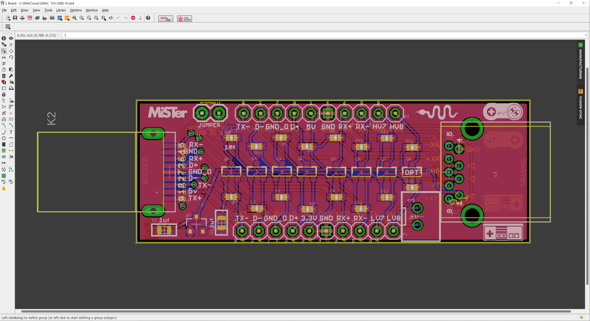
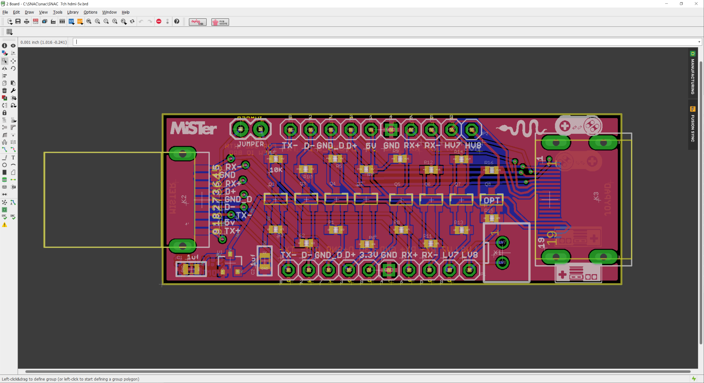
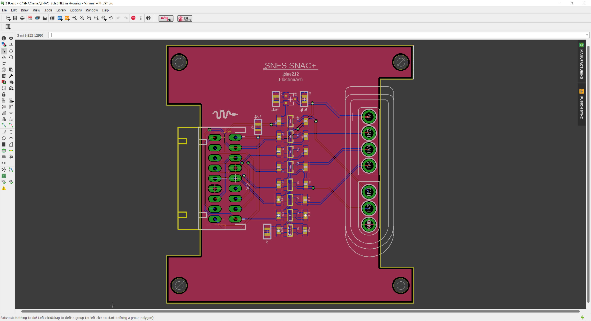
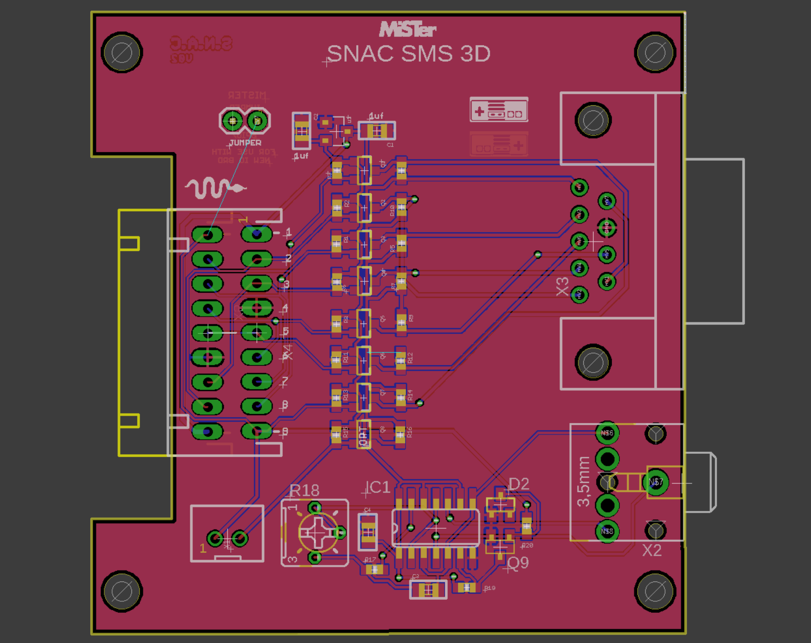
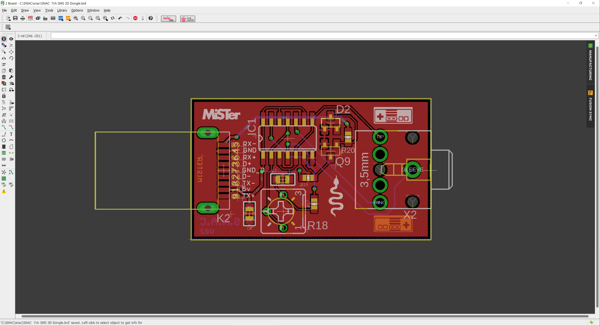

# SNAC
Accessory converter for MiSTer, by blue212

Serial Native Accessory Converter

SNAC is general purpose level shifter for use with MiSTer. It can be used to power 5v devices and it will safely convert any logic between the 3v3(MiSTer) and 5 device. It will be used mostly for 5v controllers and other peripherals.

The SNAC connects to the User port(formerly Serial I/O port) of the IO board on Mister. I recommend a male to female usb3 extension cable between them.

The SNAC is available in 2 versions the only difference being the connector on the controller side(USB3 or HDMI). Various adapters can then be plugged into that connector. I made various adapter PCCBs for use with the USB3 verrsion.

Becasue the SNAC connects to the User port the peripheral connects to the GPIO of the MiSTer, this bypasses all layers the normal usb controllers use. So it's very much like having a controller port for the original system. One benefit of this is that most weird peripherals should work with their cores(like Lightguns etc) which most normal usb converters either don't or can't do. One downside to bypassing the layers is the you can't controle the OSD.

*A mod to the IO board is needed if you want to use SEGA peripherals. A possible IO board revision in the future may fix this requirement.

-TODO detail the needed mod

-Updates

Changed the partslist to use a different part for the male USB connector.

Uxcell a19032000ux0260 instead of Wuerth 692112030100

Combined SNES versions, and SMS DB9 version added by ElectronAsh.

#Both SNES versions, and the SMS DB9 version are UNTESTED.
Please do not build until they are confirmed working.

Version with JST XH for the USER IO connection, and PCB meant for a specific housing.
You can find the housing on eBay, using the search term "enclosure 90x70x28mm"

The 3D Glasses driver circuit is from e-panorama...
<https://www.epanorama.net/circuits/sega3d.html>

The circuit has been tested on the SMS core now, but it needs a charge pump circuit added, to boost the LCD drive voltage to around 10 Volts.
Without that, the LCDs don't darken enough, and the ghosting is quite severe.

I tested the circuit by powering the CD4030 chip with 10V from a bench PSU. 
(That should ONLY be done if you completely isolate that 10V from the 5V pin on the USER PORT, otherwise it will damage the DE10 Nano.)

The dongle was tested with the Asus VR-100G LCD shutter glasses, and a JVC monitor.
The frequency of the oscillator that drives the LCDs doesn't seem to have any particular sweet spot for reduction ghosting, but the circuit generally works fine.

The standalone dongle version of the 3D Glasses driver is for people who don't mind using the SMS core with a USB joypad, and just want the 3D glasses option.
(in which case, both SMS buttons will obviously work fine when mapping from a USB joypad, or USB keyboard.)

I updated the SMS core repo on my github with a new menu options (in the Input section) for SNAC-Only, 3D-Only, or SNAC+3D.

<https://github.com/ElectronAsh/SMS_MiSTer/blob/f2dcc660f143cf5afca576f203ca9adbdb81673e/SMS.sv#L199>

One caveat of the 3D mode is that the signal normally used for the Button 2 input from the SMS joypad is used to control the 3D glasses.
So Button 2 won't work in games when 3D glasses mode is enabled.

This also means the option for the "Pause Button Combo" won't work either via SNAC (real SMS joypad) with 3D glasses mode enabled, and the Pause option will be greyed out in the OSD.
(But you can still use the Pause button mapping from a USB joypad.)

AFAIK, SMS Light Gun support should still work via the SNAC adapter with 3D Glasses enabled, but this is currently UNTESTED.
I believe Missile Command 3-D is one of the few SMS games to support 3D Glasses and the Light Gun at the same time.

