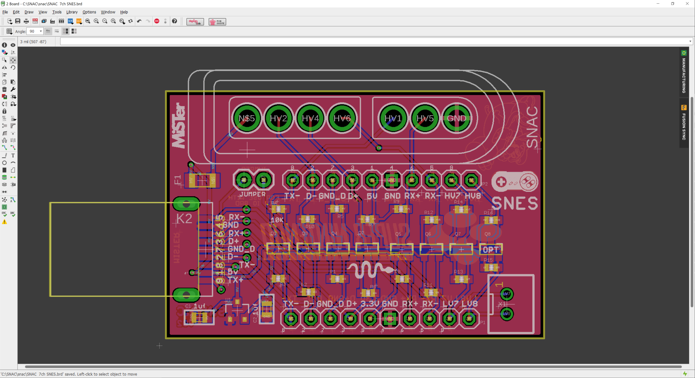
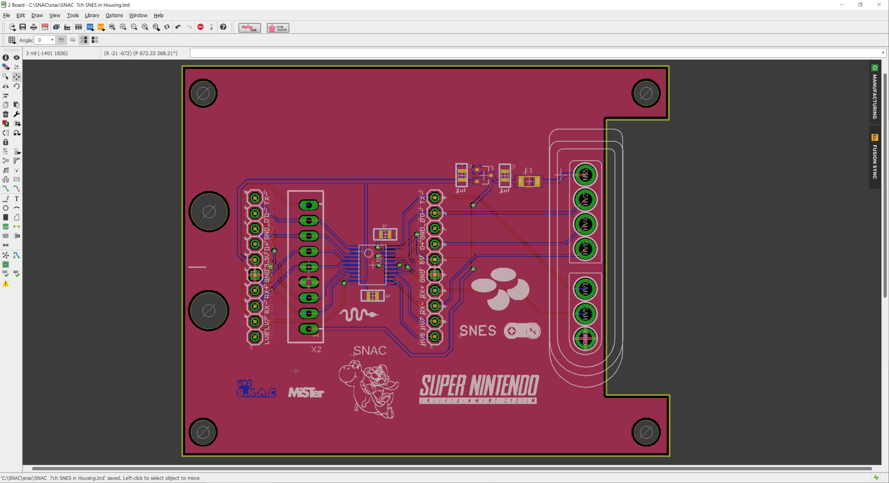
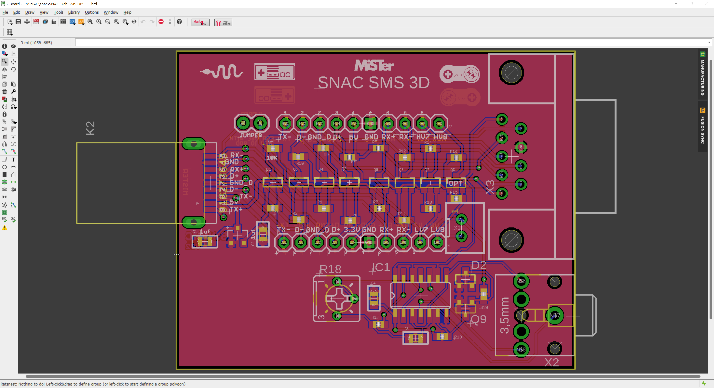

# SNAC
Accessory converter for MiSTer, by blue212

Serial Native Accessory Converter

SNAC is general purpose level shifter for use with MiSTer. It can be used to power 5v devices and it will safely convert any logic between the 3v3(MiSTer) and 5 device. It will be used mostly for 5v controllers and other peripherals.

The SNAC connects to the User port(formerly Serial I/O port) of the IO board on Mister. I recommend a male to female usb3 extension cable between them.

The SNAC is available in 2 versions the only difference being the connector on the controller side(USB3 or HDMI). Various adapters can then be plugged into that connector. I made various adapter PCCBs for use with the USB3 verrsion.

Becasue the SNAC connects to the User port the peripheral connects to the GPIO of the MiSTer, this bypasses all layers the normal usb controllers use. So it's very much like having a controller port for the original system. One benefit of this is that most weird peripherals should work with their cores(like Lightguns etc) which most normal usb converters either don't or can't do. One downside to bypassing the layers is the you can't controle the OSD.

*A mod to the IO board is needed if you want to use SEGA peripherals. A possible IO board revision in the future may fix this requirement.

-TODO detail the needed mod

-Updates

Changed the partslist to use a different part for the male USB connector.

Uxcell a19032000ux0260 instead of Wuerth 692112030100

Combined SNES versions, and SMS DB9 version added by ElectronAsh.

#Both SNES versions, and the SMS DB9 version are UNTESTED.
Please do not build until they are confirmed working.

Version with JST XH for the USER IO connection, and PCB meant for a specific housing.
You can find the housing on eBay, using the search term "enclosure 90x70x28mm"

The 3D Glasses driver circuit is from e-panorama...
<https://www.epanorama.net/circuits/sega3d.html>

3D Glasses are currently UNTESTED, and requires a small amount of logic added to the SMS core...
<https://github.com/ElectronAsh/SMS_MiSTer/commit/f1a9c6a14ab4abe10b41bc215fec268e2c4a9a41#diff-611f67d650ae8753f9f84d55af3e77cf4d1eb36c99074ed24b0de36e7d29d69eR517>

